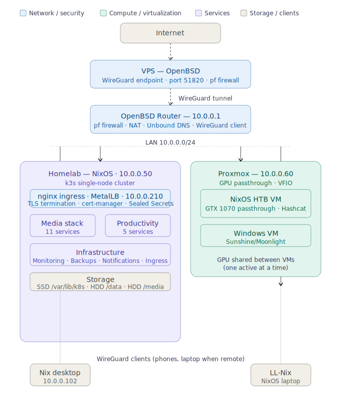
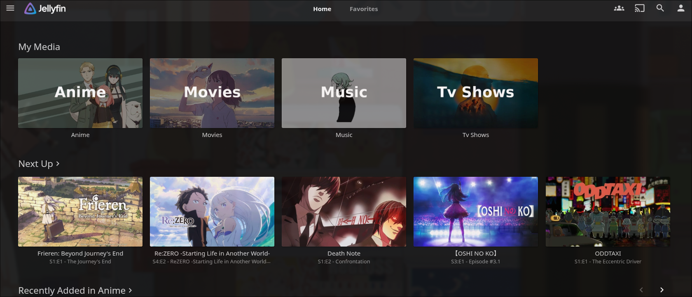
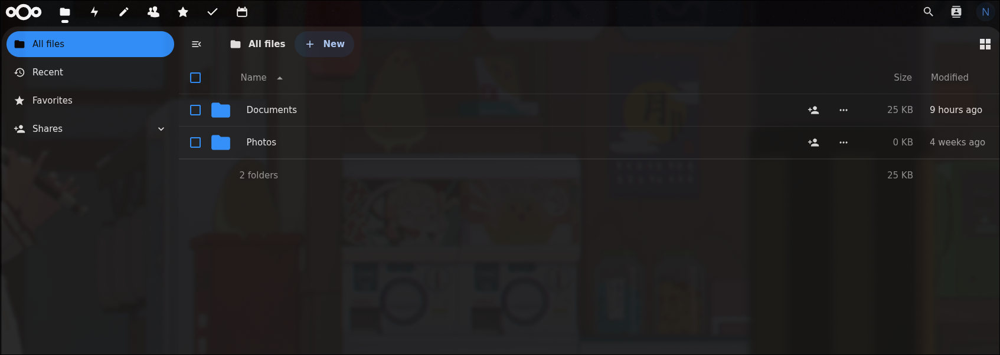
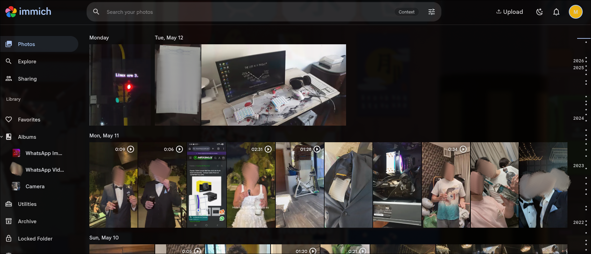
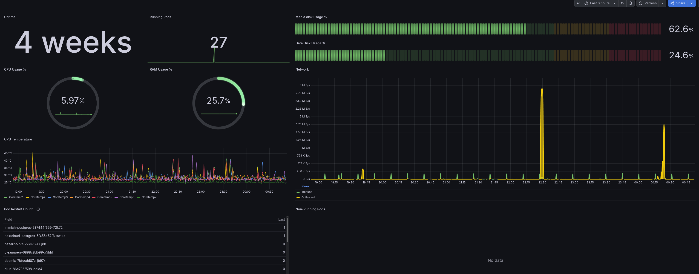

# Homelab Infrastructure

A production-style self-hosted infrastructure platform built on Kubernetes, NixOS, OpenBSD, and Proxmox. All services are self-hosted, all configuration is declarative and version-controlled, and nothing is exposed to the internet except a WireGuard VPN endpoint.

## Architecture Overview



**Security model:** Nothing is exposed to the internet except WireGuard port 51820 on the VPS. All services are accessed via WireGuard VPN or LAN only.

## Infrastructure Stack

| Layer | Technology |
|-------|-----------|
| OS | NixOS (declarative, flake-based) |
| Container Orchestration | k3s Kubernetes |
| Load Balancer | MetalLB |
| Ingress | nginx ingress controller |
| TLS | cert-manager + Let's Encrypt (Cloudflare DNS-01) |
| Secret Management | Sealed Secrets |
| Network | OpenBSD pf firewall + WireGuard VPN |
| Virtualization | Proxmox VE (GPU passthrough/VFIO) |
| Monitoring | Prometheus + Grafana |
| Backups | Velero (k8s) + Kopia (file-level) |
| Notifications | Diun + ntfy |

## Services (50+ pods)

### Media
| Service | Description |
|---------|-------------|
| Jellyfin | Media server |
| Radarr | Movie management |
| Sonarr | TV management |
| Lidarr | Music management (Deemix integration) |
| Prowlarr | Indexer management |
| Bazarr | Subtitle management |
| Jellyseerr | Media requests |
| MusicSeerr | Music requests |
| qBittorrent | Torrent client |
| Navidrome | Music streaming |
| slskd | Soulseek client |
| Soularr | Soulseek automation |

### Productivity
| Service | Description |
|---------|-------------|
| Nextcloud | File sync, notes, tasks, bookmarks, calendar, contacts |
| OnlyOffice | Document editing (integrated with Nextcloud) |
| Immich | Photo backup + ML (facial recognition, smart search) |
| Syncthing | File synchronization across all devices |

### Infrastructure
| Service | Description |
|---------|-------------|
| Kopia | Backup server |
| MinIO | S3-compatible storage (Velero backend) |
| Velero | Kubernetes state backup |
| Prometheus | Metrics collection |
| Grafana | Dashboards + alerting |
| ntfy | Push notifications to Android |
| Diun | Container update monitoring |
| Sealed Secrets | Secret management |
| cert-manager | TLS certificate automation |
| MetalLB | Load balancer |
| nginx ingress | Reverse proxy / TLS termination |

### Screenshots


*Jellyfin media server*


*Nextcloud file manager*


*Immich photo library with ML-powered facial recognition*

## NixOS Configuration

All machines are managed declaratively via NixOS flakes. The configuration is fully reproducible — any machine can be rebuilt from scratch using only the flake.

```
nixos/
├── flake.nix              # Flake inputs and host definitions
├── hardware-configuration.nix
└── modules/               # Shared modules
    ├── ssh.nix            # SSH configuration
    ├── syncthing.nix      # Syncthing setup
    ├── kopia.nix          # Backup client (systemd timer)
    ├── sudo.nix           # Sudo rules
    └── ...
```

## Kubernetes Manifests

All services are defined as Kubernetes manifests organized by service. Each service directory typically contains:

```
kubernetes/
└── service-name/
    ├── deployment.yaml      # Pod spec and container config
    ├── service.yaml         # Internal cluster networking
    ├── ingress.yaml         # External access via nginx
    ├── certificate.yaml     # TLS cert via cert-manager
    └── *-sealed.yaml        # Encrypted secrets (Sealed Secrets)
```

## Secret Management

All secrets are managed via [Sealed Secrets](https://github.com/bitnami-labs/sealed-secrets). Rather than storing plaintext credentials in the repository, secrets are encrypted using the cluster's public key before being committed. The encrypted values are completely safe to store in a public repository. They can only be decrypted by the Sealed Secrets controller running inside the specific cluster that generated the key pair. This allows the entire infrastructure to be version-controlled and publicly shared without exposing any sensitive data.

## Network Architecture

- **VPS (OpenBSD)**: WireGuard server, receives all inbound VPN connections
- **Router (OpenBSD + pf)**: Firewall, NAT, WireGuard client, Unbound DNS resolver
- **Internal DNS**: All `*.sigilos.st` subdomains resolve to the nginx ingress IP (10.0.0.210) via Unbound on the router and VPS
- **TLS**: cert-manager automatically issues and renews Let's Encrypt certificates via Cloudflare DNS-01 challenge — no ports need to be open for certificate issuance

## Backup Strategy

- **Kubernetes state**: Velero daily snapshots stored in MinIO (local S3-compatible storage)
- **File-level**: Kopia daily snapshots to the Kopia server running on the homelab
- **Clients**: PC and laptop back up `/home` daily at 2am via systemd timer with `Persistent=true` (runs on boot if the scheduled time was missed)
- **Retention**: 7 daily, 4 weekly, 6 monthly snapshots

## Monitoring

Prometheus + Grafana with a custom home dashboard tracking:
- CPU, RAM, and disk usage (with alerting thresholds)
- Pod restart counts per service
- Non-running deployments
- Network traffic (inbound/outbound)
- CPU temperature
- System uptime

Alerts fire to ntfy (self-hosted push notification server) which delivers notifications to Android phones when disk usage exceeds 85%, pods fail, CPU temperature spikes, or RAM usage is high.



## Machines

| Host | OS | Role |
|------|----|------|
| Homelab | NixOS | k3s single-node cluster |
| Nix | NixOS | Desktop workstation |
| LL-Nix | NixOS | Laptop (AMD+NVIDIA Prime offload) |
| Proxmox | Proxmox VE | Virtualization server |
| nixos-htb | NixOS (VM) | Cybersecurity / HTB labs (NVIDIA GPU passthrough) |

## Prerequisites

To deploy this infrastructure you will need:

- A server or PC running NixOS (this setup uses a single-node k3s cluster)
- A VPS running OpenBSD for the WireGuard relay (any VPS provider works)
- A domain name with Cloudflare DNS (required for cert-manager DNS-01 challenge)
- A Cloudflare API token with DNS edit permissions
- A Sealed Secrets controller deployed in your cluster (required to decrypt the sealed secrets in this repo — note: the sealed secrets here are encrypted for this specific cluster and cannot be decrypted elsewhere; you will need to re-seal your own secrets)
- MetalLB configured with an IP range on your LAN
- Basic familiarity with Kubernetes, NixOS, and networking

## Deployment

> **Note:** The Sealed Secrets in this repository are encrypted for this specific cluster's key pair. If you are deploying on a new cluster you will need to generate your own secrets and seal them with your cluster's public key.

### 1. Bootstrap the cluster

```bash
# Install k3s on NixOS
services.k3s.enable = true;

# Apply core infrastructure (order matters)
kubectl apply -f kubernetes/namespaces/
kubectl apply -f kubernetes/metallb/
kubectl apply -f kubernetes/ingress-nginx/
kubectl apply -f kubernetes/cert-manager/
kubectl apply -f kubernetes/storage/
```

### 2. Deploy Sealed Secrets controller

```bash
kubectl apply -f https://github.com/bitnami-labs/sealed-secrets/releases/latest/download/controller.yaml
```

### 3. Create your own sealed secrets

Each service that requires secrets has a `*-sealed.yaml` file. You will need to recreate these with your own credentials using your cluster's public key:

```bash
# Fetch your cluster's public key
kubeseal --fetch-cert --controller-name=sealed-secrets-controller \
  --controller-namespace=kube-system > pub.pem

# Seal a new secret
kubectl create secret generic my-secret \
  --from-literal=key=value \
  --dry-run=client -o yaml | \
  kubeseal --cert pub.pem --format yaml > my-secret-sealed.yaml
```

### 4. Deploy services

```bash
# Deploy all services
kubectl apply -f kubernetes/immich/
kubectl apply -f kubernetes/nextcloud/
# ... etc
```

## Known Issues & Limitations

- **Single node**: The k3s cluster runs on a single node — there is no high availability. If the homelab goes down, all services go down.
- **CGNAT**: The homelab ISP uses CGNAT so the homelab has no public IP. All external access is routed through the VPS via WireGuard.
- **OnlyOffice version pinning**: OnlyOffice is pinned to version 8.2 due to a compatibility issue with the Nextcloud ONLYOFFICE app and newer OnlyOffice versions (9.x changed the internal file structure).
- **Sealed Secrets are cluster-specific**: The encrypted secrets in this repo cannot be decrypted outside of the original cluster. Anyone deploying this will need to generate and seal their own secrets.
- **GPU passthrough**: The NVIDIA GTX 1070 is passed through to either the Windows VM or the NixOS HTB VM — not both simultaneously. Switching requires stopping one VM before starting the other.
- **Music stack**: Some albums are not available on Soulseek or Deezer lots require manual sourcing and/or managing.
